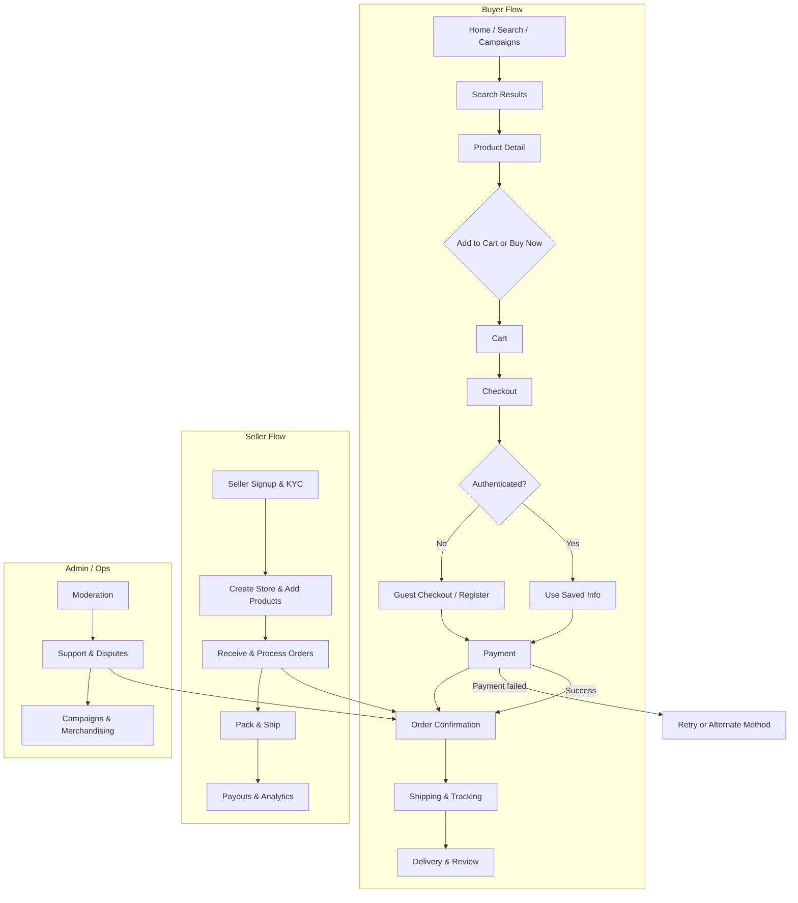

# Deconstruct: Tokopedia.com 🛒

**Versi:** 1.0 • **Tanggal:** 2026-01-06

---

## 1. Ringkasan Eksekutif 💡
Ringkasan singkat tentang Tokopedia: marketplace besar Indonesia yang menghubungkan penjual & pembeli, menyediakan layanan e‑commerce end-to-end (listing, payment, logistics, promosi). Dokumen ini menganalisis produk, UX, arsitektur, monetisasi, dan peluang inovasi.

---

## 2. Tujuan Analisis 🎯
- Memahami bagaimana Tokopedia menyusun pengalaman pengguna (onboarding → discovery → purchase → post-purchase).
- Mengidentifikasi fitur kunci dan pola desain yang mendukung skalabilitas dan retensi.
- Menyediakan rekomendasi untuk membangun produk serupa atau meniru fitur kunci.

---

## 3. Target Pengguna & Persona 👥
- Pembeli casual: mencari produk, bandingkan harga, promosi.
- Pembeli power-user: menggunakan fitur wishlist, notifikasi, promo personal.
- Penjual UMKM: listing produk, manajemen order, promosi.
- Admin/Operator: moderasi, analytics, support.

---

## 4. User Journey (ringkas) 🔁
1. Temukan: Search / kategori / rekomendasi / kampanye.
2. Evaluasi: product page (foto, review, OTR, seller info, opsi pengiriman).
3. Checkout: cart, coupon, metode pembayaran (e-wallet, transfer, COD), ongkos kirim.
4. Fulfillment: order processing, shipping tracking, returns.
5. Retention: notifikasi, loyalty, promo khusus, review & feedback.

---

## 5. Fitur Inti & Prioritas Produk ⭐
- Search & discovery: autosuggest, filters, relevance ranking
- Product detail: multiple images, specs, reviews, seller rating
- Checkout & payments: multi‑payment, saved-pay, vouchers
- Logistics: shipping options, real-time tracking
- Seller tools: dashboard, inventory, analytics
- Campaigns & promotions: flash sale, voucher ecosystem
- Trust & safety: buyer protection, dispute resolution

---

## 6. UI/UX Patterns & Best Practices 🎨
- Mobile-first, simple header with search prominent
- Use of microcopy and badges (promo, seller verified, fast ship)
- Persistent cart & contextual upsells
- Checkout flow minimizing friction (guest checkout, progress indicators)
- Visual hierarchy: images > price/promo > shipping > CTA

---

## 7. Teknologi & Arsitektur (hipotesis) 🏗️
- Frontend: mobile apps (React Native / native Kotlin + Swift) + responsive web (React/Vue)
- Backend: microservices (Node.js/Java/Golang) exposing REST/GraphQL APIs
- Data stores: PostgreSQL / MySQL (OLTP), Redis (cache), Cassandra / HBase (analytics/event logs)
- Search: Elasticsearch / OpenSearch for product search & facets
- Messaging: Kafka / RabbitMQ for event-driven flows (orders, notifications)
- Payments: integrations with local payment gateways & e-wallets
- Infrastructure: Kubernetes, CDNs, WAF, multi-AZ deployments

---

## 8. Data & Analytics 📊
- Events tracking (product impressions, clicks, add-to-cart, conversions) → used for personalization and recommendation
- AB testing platform for experiments on UI, promos, and ranking
- Data warehouse (e.g., BigQuery/Redshift) for BI and merchant insights

---

## 9. Skalabilitas & Performance ⚡
- Caching layers (Redis + CDN) for catalog and static assets
- Read-replicas for DB and CQRS for write-heavy workflows
- Autoscaling for peak events (flash sales)
- Asynchronous processing for heavy tasks (image processing, analytics ingestion)

---

## 10. Keamanan & Kepercayaan 🔒
- TLS everywhere, token-based auth (JWT / sessions for web), 2FA for sensitive ops
- Fraud detection (transaction risk scoring), rate limiting, input validation
- Buyer protection and clear SLA for disputes

---

## 11. Monetisasi & Model Bisnis 💸
- Komisi dari penjualan (seller fees)
- Iklan & promoted listings
- Layanan premium seller (analytics, logistics, financing)
- Transaksi value-adds (escrow, insurance)

---

## 12. Growth & Retention Taktik 📈
- Campaigns: campaigns besar (harbolnas / flash sale)
- Coupons & personalization: personalized vouchers and targeted promo
- Loyalty: point system & gamified promotions
- Merchant growth: onboarding tools, seller education, pre-verified logistics partners

---

## 13. Competitive Advantages & Risks ⚖️
- Keunggulan: brand trust, ekosistem layanan (logistics + payment + merchant tools), skala pengguna
- Risiko: regulasi marketplace, persaingan (Shopee, Bukalapak), cost of promotions & subsidies

---

## 14. Opportunities & Feature Ideas 💡
- Improved search ranking signals using CLTV & seller reliability
- Hybrid marketplace + social features (user-generated collections, shoppable livestream)
- Micro‑financing integration for small merchants
- AI-powered product photo/description enhancement for seller tools

---

## 15. Implementation Roadmap (contoh) 🛠️
1. MVP: catalogue, search, product page, cart, checkout (6–8 minggu)
2. Payments & logistics integration (2–4 minggu)
3. Seller dashboard & basic analytics (3–4 minggu)
4. Promo engine & voucher flows (2–3 minggu)
5. Scale & monitoring: caching, search tuning, autoscaling (ongoing)

---

## 16. Metrics to Track (OKR/KPI) 📋
- Conversion rate (visitors → purchasers)
- GMV (gross merchandise value)
- AOV (average order value)
- Retention (30/90-day active users)
- Time to ship / on‑time delivery

---

## 17. Appendix & References 📎
- Public resources, blog posts, and engineering talks about marketplace architecture
- Research sources: company engineering blogs, case studies

---

## 18. User Flow Diagrams (Mermaid) 🔁
Berikut diagram alur utama (buyer, seller, admin, search/checkout) menggunakan Mermaid flowchart.

> Tip: copy the Mermaid block into a Markdown viewer that supports Mermaid (e.g., VSCode Markdown preview with Mermaid) to visualize the flow.

---

**Next step:** Beri tahu jika Anda mau saya kustomisasi dokumen ini menjadi rencana implementasi (roadmap + backlog) atau membuat versi ringkas untuk presentasi.  

*Disimpan sebagai `deconstruct tokopedia.md`*